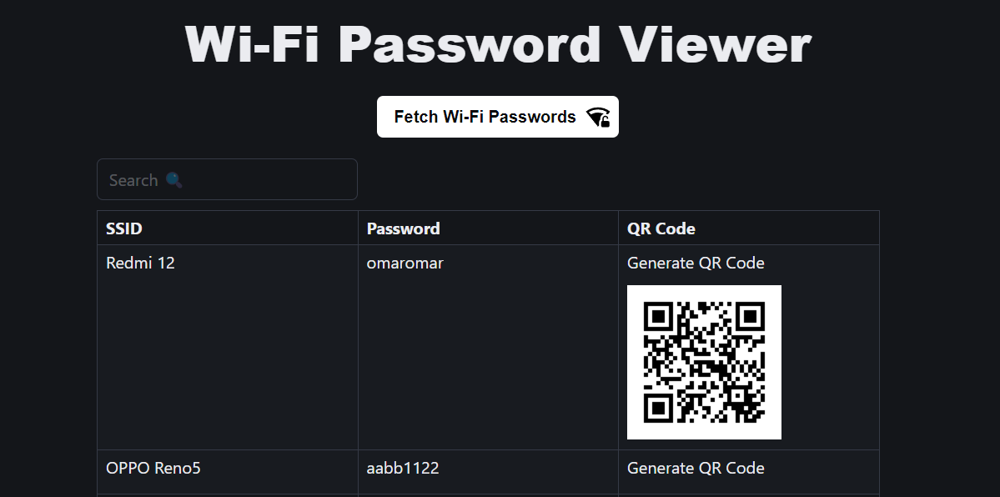

# Wi-Fi Password Sharing App

This is a simple Electron application that enables users to easily share Wi-Fi passwords across devices. Built with Electron and Node.js, the app provides a user-friendly interface for securely managing and sharing network credentials.

## Features
- **View Saved Wi-Fi Networks**: Displays a list of saved networks on the device.
- **Retrieve Passwords**: Retrieve and view saved Wi-Fi passwords (requires administrative privileges).
- **QR Code Sharing**: Generate QR codes for easy sharing of network credentials.
- **Secure Storage**: Encrypts sensitive data to ensure security.
- **Cross-Platform**: Runs on Windows, macOS, and Linux.

---

## Requirements
- **Node.js**: Version 16 or higher.
- **Electron**: Version 25 or higher.
- **OS Support**: Windows 10+, macOS 11+, and modern Linux distributions.

---
## Screenshots

### Home Screen
This is the main interface of the app:

